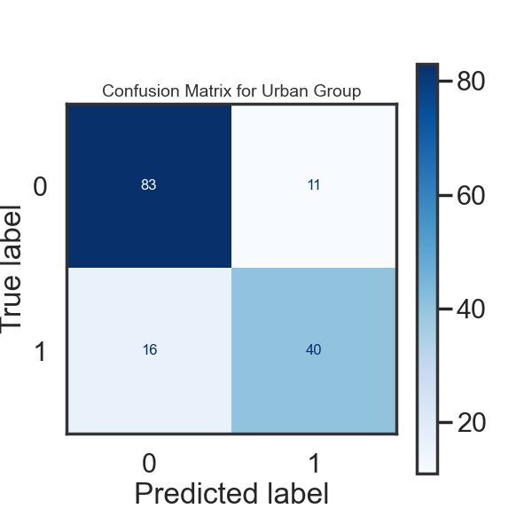

## Introduction

Power outages have become increasingly frequent in the United States due to the stress of extreme weather, aging infrastructure, and increasing energy demand. The United States, according to the [University of Buffalo's Department of Industrial and Systems Engineering](https://www.popsci.com/story/environment/why-us-lose-power-storms/), has the highest number of power outages among developed nations; it is a problem estimated to cost billions annually across the entire nation. Each US citizen is estimated to experience 2 hours of power outage per year on average.  That is why it is crucial to understand how the characteristics of power outages in the United States have shifted over time and what the main catalysts are.

This study investigates the trends in power outages across the nation, identifies the primary drivers for these events and hopes to provide relevant information that may assist communities and their policy makers in reducing the frequency and impact of this phenomena. The focus of our analysis will be answering the following questions: 

<b>Where and when do major outages tend to occur?</b>

<b>Predict the cause of a major power outage?</b>

The data we have used comes from the scientific dataset [Data on major power outage events in the continental U.S](https://www.sciencedirect.com/science/article/pii/S2352340918307182?ref=pdf_download&fr=RR-2&rr=8e45b02bd9d82a8f) and contains the major power outage data in the continental U.S. from January 2000 to July 2016. With this data, we will employ data analysis techniques to determine patterns in power outages, draw conclusions from that analysis, and create a predictive model of what the cause of a major power outage in the United States might be.  

-------

### Relevant Column & Descriptions
The original dataset contained 1534 observations and 55 variables (columns).
For our analysis we will be using a modified version of the dataframe composed of 1534 columns and 18 variables. 
Below is a table with the variables we maintained and a description of what they describe.

| COLUMN                      |    DESCRIPTION                                                              |
|-----------------------------|-----------------------------------------------------------------------------|
| `YEAR`                      | Year the outage occurred                                                    |
| `MONTH`                     | Month the outage occurred                                                   |
| `U.S._STATE`                | State where the outage occurred                                             |
| `POSTAL.CODE`               | State's Postal Code                                                         |
| `CLIMATE.REGION`            | U.S. Climate regions as specified by National Centers for Environmental Information (9 Regions) |
| `ANOMALY.LEVEL`             | Oceanic El Niño/La Niña (ONI) index referring to cold/warm episodes (estimated as a 3-month running mean) |
| `CLIMATE.CATEGORY`          | Represents the climate episodes corresponding to the year                   |
| `OUTAGE.START.DATE`         | Day of the year when the outage event started                               |
| `CAUSE.CATEGORY`            | Categories of all events causing major power outages                        |
| `CAUSE.CATEGORY.DETAIL`     | Detailed description of the event categories causing the power outages      |
| `OUTAGE.DURATION`           | Duration of outage events (in minutes)                                      |
| `DEMAND.LOSS.MW`            | Amount of peak demand lost during an outage event (in Megawatt)             |
| `CUSTOMERS.AFFECTED`        | Number of customers affected by the power outage event                      |
| `RES.SALES`                 | Electricity consumption in the residential sector (megawatt-hour)           |
| `COM.SALES`                 | Electricity consumption in the commercial sector (megawatt-hour)            |
| `IND.SALES`                 | Electricity consumption in the industrial sector (megawatt-hour)            |
| `TOTAL.SALES`               | Total electricity consumption in the U.S. state (megawatt-hour)             |
| `POPULATION`                | Population in the state                                                     |
| `POP_DEN_URBAN`             | Urban Population Density the state                                          |
| `POP_DEN_RURAL`             | Rural Population Density the state                                          |

---

### Data Cleaning and Exploratory Analysis

#### Data Cleaning
Our first step in data cleaning was to discern which columns in the dataset are necessary for the analysis. For example, we removed all the columns regarding regional economic outputs, electricity prices and land area such as; `PC.REALGSP.STATE`, `PC.REALGSP.USA`, `AREAPCT_URBAN`, `AREAPCT_UC.` Moreover, we removed certain colums about the percentage of electricity consumption because we want to use the absolute electricity usage. Another section of columns we found less relevant to our analysis were the customer served variables. However, we kept the states' population to understand how the changes in absolute electricity consumption relate to the population. You can scroll through the image below and look at what out dataset looks like.

As mentioned in the article [A multi-hazard approach to assess severe weather-induced major power outage risks in the U.S](https://www.sciencedirect.com/science/article/pii/S0951832017307767), our data contains reporting errors and missing values due to:
- Inadequate reporting causing underreported incidents.
- Changes in regulatory requirements over time, may have caused underestimation of the actual number of incidents that happened during the period.

Once we narrowed down the variables for our analysis, made some adjustments to the variables:

- Combined `OUTAGE.START.DATE` and `OUTAGE.START.TIME` into a single variable named `OUTAGE.START' using `pd.to_datetime`.
- We actively decided to maintain missing variables as `NaN` or `NaT` until we complete our Missingness Analysis.
- We also removed extra spaces from categorical columns using `str.strip()`

It is important to note that the abstract of our dataset determines that "A major power outage in this dataset refers to "those that impacted atleast 50,000 customers or caused an unplanned firm load loss of atleast 300 MW." However, out dataset contains several rows where both `DEMAND.LOSS.MW` and `CUSTOMERS.AFFECTED` are NA or 0 which seems alarming given that these ar ethe two characteristics by which the event was reported. As such, we have decided to replace all values of 0 in these columns with `NaN` as well as the values of 0 in `OUTAGE.DURATION`

###### Visual of our dataset
<iframe src="assets/images/outages_head.html" width="100%" height="200" frameBorder="0" ></iframe>

#### Univariate Analysis

    <h5 style="margin: 0 0 20px 0; text-align: center; color: darkblue;"> Total Outages per Year: </h5>
    

        

            <iframe src="assets/images/outages_by_year.html" style="width: 100%; height: 300px; border: none;"></iframe>
        

        

            
 

               
               Our first univariate analysis was the number of outages per year. Our interest was to decipher if there was a trend in the number of outages over the years recorded. This was a way to see if the worsening of the extreme climate conditions or the increase in electricity consumption had an impact on the number of outages. 
            

        

    

    <h5 style="margin: 0 2px 20px 0; text-align: center; color: darkblue;">Total Outages per State:</h5>
    

        

            <iframe src="assets/images/outages_by_state.html" style="width: 105%; height: 350px; border: none; margin-right: 2px"></iframe>
        

        

            
 
            
               
               Our second univariate analysis was the total number of power outages by state. In relation to our idea of increasing electricity demand and usage over time and population, we quantified these values. This is because over time, certain states have become more populated than others. We also wanted to see if certain states were more prone to power outages perhaps due to climate region, electricity usage, crime...etc.
            

        

    

    <h5 style="margin: 0 2px 20px 0; text-align: center; color: darkblue;">Distribution of Power Outage Causes:</h5>
    

        

            <iframe src="assets/images/distribution_of_power_outage_cause.html" style="width: 105%; height: 350px; border: none; margin-right: 2px"></iframe>
        

        

            
 
            
               
               Our last univariate analysis was to understand the distribution of causes for reported power outages from 2000 to 2016. From this pie chart we can observe that during this time the two most frequent causes of power outages were intentional attacks with a over a quarter of the power outages and extreme weather with almost half of the power outages resulting from it.
            

        

    

#### Bivariate Analysis

    <h5 style="margin: 0 0 20px 0; text-align: center; color: darkblue; width: 100%;">
        Total Outages Per Climate Region:
    </h5>
    

        

            
 
               
                Our first Bivariate analysis focused on creating a chart that reflected the number of outages per the 7 major climatic regions as defined by the National Center for Environmental Information. The idea to create this plot was to identify regions where more outages occurred and potentially direct our focus to identify the causes why some regions had more power outages than others.
            

        

        

            <iframe src="assets/images/outages_by_region_map.html" style="width: 110%; height: 300px; border: none;"></iframe>
        

    

    <h5 style="margin: 0 0 20px 0; text-align: center; color: darkblue; width: 100%;">
        Power Outages Per Climate Region and The Cause Distribution:
    </h5>
    

        

            
 
               
               Our second Bivariate analysis focused on comparing the number of total power outages each region has experienced from January 2000 to July 2016 and what the causes were. As such we created a stacked bar plot where each climate region's bar was distributed in size by the number of outages resulting from a specific cause.
               

                

        

           <iframe src="assets/images/bivariate_stacked_barplot.html" style="width: 105%; height: 400px; border: none;"></iframe>
         

    

    <h5 style="margin: 0 0 20px 0; text-align: center; color: darkblue; width: 100%;">
        Number Power Outages Per State and The Cause:
    </h5>
    

        

            
 
               
              Lastly, and similar to the graph above, we calculated the total number of power outages reported during this time by each state and the cause. As you might see, there is a notoriously large amount of the power outages throughout the different states caused by extreme weather. This could indicate a relationship between extreme weather and weather patterns with power outages. 
               

                

        

           <iframe src="assets/images/bivariate_stacked_barplot_by_state.html" style="width: 105%; height: 400px; border: none;"></iframe>
         

    

#### Interesting Aggregates
<h5 style="margin: 15px 0 10px 0; text-align: center; color: darkblue;"> Pivot Table #1: </h5>
This first pivot table consists of the 9 different climate regions in the United States and the number o
f power outages that occured in those regions, separated by cause category. Essentially, this pivot table can help us visualize trends of power outage occurence and cause in the different climatic regions. For example, the Northeast region experienced the most outages during the years of our data with 350 outages over the course of 10 years. The majority of these were caused either by severe weather (176) or intentional attacks(135).

  <iframe src="assets/images/pivot_table_outages_by_year_&_climate_region.html" width="100%" scrolling="yes" frameBorder="0" style="display: block; text-align: center;"> </iframe>
  

<h5 style="margin: 15px 0 10px 0; text-align: center; color: darkblue;"> Pivot Table #2: Total Number of Outages by Month Occurance and Cause </h5>

The overarching idea of this project is to understand patterns in when, why, and perhaps where power outages occured from January 2000 to July 2016. In this pivot table, we are calculating the total number of outages that occured due to a specific cause in a specific month. The goal was to see if certain months are more likely to suffer certain power outages whether it be due to severe weather and seasonality or due to other causes such as vandalism, public appeal...etc. 

While we did not separate by State which is relevant in terms of climate, we wanted to observe if there were any cylcical trends in the outages. In this pivot table, we can observe that vandalism is a constant cause of power outages throughout the months. Another detail to highlight is that thunderstorms amass the largest number of outages within the severe weather category and occured substantially more often in May, June, and July whilst winterstorms - the second largest severe weather contributor to the outages- occurred most prominently in January and February. 

  <iframe src="assets/images/outages_by_month.html" width="100%" scrolling="yes" frameBorder="0" style="display: block; text-align: center"> </iframe>

  
------

### Assessment of Missingness

#### NMAR Analysis
One of the types of missing data that exists is NMAR which stands for **N**ot **M**issing **A**t **R**andom. This instance of missingness in data occurs when the values of the data itself is not disclosed. It depends only on the values themselves and not on other variables (columns). Because NMAR data is unobservable, it has to be analyzed by either collecting more data or reasoning about the data generating 
process. 

As mentioned above, regulatory requirements have fluctuated over the time period. One column that might be NMAR could be the `CAUSE.CATEGORY.DETAIL`. Resons for this include:
1. When the cause is due to something they might get public criticism entities in charge of the electricity might choose not to disclose the specific reason and hide under a mroe vague umbrella such as "system operability disruption".
2. Reporting agencies or electric companies who report the outage may use another affecting reason as the cause and cannot give proper details about the cause. i.e gridlines were old and vulnerable to weather and there was 'extreme weather' that day. 
3. Some categories do not have specific details to provide. i.e public appeals.

#### Missingness Dependencies

<h5 style="margin: 0 2px 20px 0; text-align: center; color: darkblue;"> Missingness Dependency of Outage Duration on Month:</h5>
For this analysis, we compared the distribution of outage duration missingness across months through a permutation test with 1000 permutations using TVD as the test statistic. During this permutation test we obtained the following values:
- Observed TVD statistic: 0.1435
- P-value: 0.153

Using a 5% significance level, we find insufficient evidence to conclude that the missingness of outage duration depends on the month of occurrence. Therefore, we infer that the missingness of outage duration is not statistically significantly dependent on the month.

<iframe src= "assets/images/OutageDuration_vs_Month.html" width="700" height="400" frameBorder="0" padding="2" ></iframe>
<iframe src="assets/images/OutageDuration_Month_Missingness.html" width="700" height="400" frameBorder="0" padding="2" ></iframe>

<h5 style="margin: 0 2px 20px 0; text-align: center; color: darkblue;"> Missingness Dependency of Outage Duration on Year:</h5>
In this analysis,  we compared the distribution of outage duration missingness across the years in our dataset through a permutation test with 1000 permutations using TVD as the test statistic. During this permutation test we obtained the following values:

- Observed TVD statistic: 0.3874
- P-value: 0.0

Using a 5% significance level, we can say that there is statistically significant evidence to determine that the missingness of outage duration depends on year. Thus, we can infer that outage duration misisngess if MAR on Year.

<iframe src= "assets/images/OutageDuration_vs_Year.html" width="700" height="400" frameBorder="0"></iframe>
<iframe src="assets/images/OutageDuration_Year_Missingness.html" width="700" height="400" frameBorder="0"></iframe>

---

### Hypothesis Testing

**Null Hypothesis**: The number of power outages is uniformly distributed across all months of the year

**Alternative Hypothesis**: The number of outages is not uniformly distributed across all months of the year

**Test Statistic**: K2 Statistic

**Significance Level**: 5%

For this part we tested whether the outage duration distributions differ if the weather indicates it was warm or cold at the moment of the power outage. The relevant columns for this analysis are the `CLIMATE.CATEGORY` that describes the weather at the moment of the outage and the `OUTAGE.DURATION` column that describes the length of the power outage. 

We performed 10,000 permutations and in order to have a representative sample to analyze. 

With these permutations we got an **observed statistic** of **0.077** and a **p-value of 0.2306**. These findings lead us to say we fail to reject the null hypothesis since there is no statistical significance of our findings at the 5% level to suggest that the distributions of outage durations differ between "cold" and "warm" climate categories.

The plot below shows the permutations carried out and the observed statistics. 
<iframe src= "assets/images/HypothesisPlot.html" width="700" height="400" frameBorder="0"></iframe>

---
### Prediction Problem: Predicting the Cause Category

Our prediction model attempts to determine ***whether a major power outage is caused by weather during the outage*** using a binary classification model that predicts whether a major power outage was caused by weather conditions or a different cause using `Weather_Related` as our response variable. `Weather_Related` takes a value of one when the outage cause is weather related and zero otherwise. 

To evaluate our models performance we use several metrics. The first is an F1 score to predict and recall how many weather-related outages were correctly predicted and identified. This metric was chosen over accuracy due to the imbalance in outage cause observations in our data to balance precision and recall. Additionally, we added a classification report. This report gives a more in depth analysis of the metrics within each class (weather cause outages and non-weather outage causes) as it includes the scores for F1, Accuracy, Recall, Support for each. Support, for example shows us the true instances of each event. The report also gives us the accuracy with which each event was correctly predicted however this is a misleading statistic by itself. The macro average computes the unweighted mean of F1, precision and, accuracy giving us a measure of how well our model performs across all these metrics. On the overhand, the weighted average gives us the same measurement except it takes into account the imbalance of each class.

Moreover, and for visual aid, we have a confusion matrix that quantifies the number of Type I and Type II Errors made by our model. This allows us to understand if our model is over or underestimating the response variable and how well it performs in classifying each group instance. This can be a helpful measure when Type I error is costly due to unnecessary resource allocation.

**Information Known At Time of Prediction**
Because our model aims to predict whether the cause of a major power outage is weather-related or not, we have access to all variables except 5 (Cause category, cause category detail, outage duration, demand loss, and customers affected)

|   Unknown       | 
|-----------------|
| 'STATE`         | 
| `CLIMATE.REGION`|                         
| `CLIMATE.CATEGORY|                          
|`ANOMALY.LEVEL`  |       
| `OUTAGE.START`  |            
| `YEAR`          |   
| `NERC.REGION`   |  
| `RES.SALES`     | 
| `COM.SALES`     |  
| `IND.SALES`     | 
| `TOTAL.SALES`   |  
| `POPULATION`    |
| `POPDEN_URBAN`  |
| `POPDEN_RURAL`  |

---

### Baseline Model

For our baseline model we created a target binary variable `Weather_Related` which determined if an outage was caused by severe weather or not. Below is the feature selection and transformations for each.

- `Weather_Related`: Binary target variable with value 1 when cause is weather related and 0 otherwise
- `CLIMATE.CATEGORY`: Qualitative (Categorical) ordinal variable. Transformed into a binary variable using OnehotEnconding dropping the first value.
- `CLIMATE.REGION`: Qualitative (Categorical) nominal variable. Transformed into a binary variable using OnehotEncoding dropping the first value.
- `ANOMALY.LEVEL`: Quantitative (Numerical) discrete variable. We standardized the anomaly level using StandardScaler().

These features were chosen due to their direct relationship to weather. We believed that these features could singularly predict to an extent whether a power outage was caused by weather or not. To evaluate our model we implemented several scoring methods. We also ensured that the features used did not contain a significant level of missing values given that we did not want to introduce too much bias by dropping them nor influence the model by imputing them. The first evaluation metric was an F1 score 

###### Performance Metric 1: F1 Score
- F1 Score: 0.682

###### Performance Metric 2: Classification Report

  <iframe src="assets/images/Baseclassification_report.html" width="80%" height="600px" frameBorder="0" scrolling="yes" style="display: block; border: none; min-width: 800px;"> </iframe>

###### Performance Metric 3: Confusion matrix

|                       |Actual Positive (1)|Actual Negative (0)|
|-----------------------|-------------------|-------------------|
| Predicted Positive (1)|       113         |        59         |
| Predicted Negative (1)|       33          |        99         |

#### Performance Analysis: 

With a 0.68 F1 score our model is performing fairly well but can still imporveability to correctly predict whether major power outages were weather related or not. Through the Classification report, we can observe that our model has a higher precision score in non-weather-related outages (when the model predicts an outage is not weather-related, about 77% of the time it is correct) but a higher recall score (the model correctly identified 75% of the weather-related outages) in weather-related outages. We see that our F1 score is closer to the recall score meaning our model may be better at predciting weather-related outages but could incorrectly include some non-weather-related ones. 

Through our macro and weighted average we see that our model is fairly balanced in performance across both classes. Our model correctly classified 70% of all instances as seen in the classification report. While this is a passing score, it can be improved. In conclusion, we think out model is above average in performance but still requires improvement for the final model.

---

### Final Model

To improve our model we implemented hyperparameter tuning and adding as well as GridSearchVC to find the best parameters for our model. 
Improvements: 

**1.** Included more features (normal and engineered):

data[`URBAN_DENSITY_NORMALIZED`] = data[`POPDEN_URBAN`] / data`"POPULATION`]
data["AVG_MW_PER_PERSON"] = data["TOTAL.SALES"]/data['POPULATION']
data['MONTH_SIN'] = np.sin(2 * np.pi * data['MONTH'] / 12).dropna()
data['MONTH_COS'] = np.cos(2 * np.pi * data['MONTH'] / 12).dropna()

- `Weather_Related`: Binary target variable with value 1 when cause is weather related and 0 otherwise
  
**CATEGORICAL FEATURES**:
- `Weather_Related`: Binary target variable with value 1 when cause is weather related and 0 otherwise
- `CLIMATE.CATEGORY`: Qualitative (Categorical) ordinal variable. Transformed into a binary variable using OnehotEnconding dropping the first value.
- `CLIMATE.REGION`: Qualitative (Categorical) nominal variable. Transformed into a binary variable using OnehotEncoding dropping the first value.

**NUMERICAL FEATURES**:
- `ANOMALY.LEVEL`: Quantitative (Numerical) discrete variable. We standardized the anomaly level using StandardScaler().
- `POPULATION`: Quantitative (Numerical) discrete variable. We standardized the anomaly level using StandardScaler().
- `URBAN_DENSITY_NORMALIZED`: Quantitative (Numerical) discrete variable. We standardized the anomaly level using StandardScaler().
- `AVG_MW_PER_PERSON`: Quantitative (Numerical) discrete variable. We standardized the anomaly level using StandardScaler().
- `MONTH_SIN` & `MONTH_COS`: Quantitative (Numerical) continuous variables (cyclic representation of months). We derived them from the MONTH column using sin and cos transformations.
- `YEAR`: Quantitative (Numerical) discrete variable. Standardized using StandardScaler().
- `TOTAL.SALES`: Quantitative (Numerical) continuous variable. Standardized using StandardScaler().
- `IND.SALES`: Quantitative (Numerical) continuous variable. Standardized using StandardScaler().
- `COM.SALES`: Quantitative (Numerical) continuous variable. Standardized using StandardScaler().
- `RES.SALES`: Quantitative (Numerical) continuous variable. Standardized using StandardScaler().

#### Justification 
The features we engineered we believe are important beacuse we believe they imporve how the model does predictions making it more accurate. 
- `URBAN_DENSITY_NORMALIZED`: This feature helps compare areas with different populations more effectively.
- `AVG_MW_PER_PERSON`: This feature helps compare the demand of electricity per person so that each regions is comparable.
- `MONTH_SIN` & `MONTH_COS`: Since most weather related phenomens are cyclical this feature helps ensure the model understands cyclical patterns.
- `POPULATION`: We believe population size has a direct correlation with outages hence adding population as a feature we believe helps imporve the predictive capabilities of the model.
- `YEAR`: The variable Year we beleive captures important patterns in long term weather related events which can help improve the model predictions.
- `TOTAL.SALES`, `IND.SALES`, `COM.SALES`, `RES.SALES`: As these features capture the sales, this provides valuable economic data that correlat with weather related events as if changes in sales exist. By analyzing these factors we believe the model could imporve its predictions capabilities. 

<iframe src= "assets/images/FeatureImportance.html" width="700" height="400" frameBorder="0"></iframe>
 
- Best Hyperparameters:
    - bootstrap: True
    - max_depth: 20
    - max_features: log2
    - min_samples_split: 2
    - n_estimators: 150
- F1 Score: 0.7697841726618705
- Confusion Matrix:

|                       |Actual Positive (1)|Actual Negative (0)|
|-----------------------|-------------------|-------------------|
| Predicted Positive (1)|       131         |        39         |
| Predicted Negative (1)|       25          |        107        |

##### Final Model Classification Report 

  <iframe src="assets/images/Finalclassification_report.html" width="80%" height="600px" frameBorder="0" scrolling="yes" style="display: block; border: none; min-width: 800px;"> </iframe>

---

### Fairness Analysis

For the Fairness Analysis we focused on analyzing outages occurring in rural areas and outages occurring in urban areas. Group X is: ⁠ `URBAN_DENSITY_NORMALIZED` ⁠ outages, focusing on the datapoints where the density is higher than the median of the `URBAN_DENSITY_NORMALIZED` column. Group Y is: ⁠ `URBAN_DENSITY_NORMALIZED` ⁠ outages, focusing on the data points that are samller than the median `URBAN_DENSITY_NORMALIZED` column as urban density and rural density are inversely related. 

As an evaluation metric we focussed on analyzing precision, which measures the proportion of true positive predictions out of all positive predictions made by the model.
We also created classifiation reports for both variables to do an in depth analysis of the precision of the models, getting necessary metrics like the precision and f1 scores.

For our Hypothesis we chose: 

**Group 1**: Normalized Urban State Population Density 
**Null hypothesis**: The model is fair. Its precision for urban density (group 1) and rural density (group 2) outages is the same, and any observed differences are due to random chance.

*Alternative Hypothesis*: The model is unfair. The precision for urban outages (group 1) is significantly different than that for rural outages (group 2).

**Group 2**: Normalized Rural State Population Density
**Null hypothesis**: The model is fair. Its precision for urban density (group 1) and rural (group 2) outages is the same, and any observed differences are due to random chance.

**Alternative Hypothesis**: The model is unfair. The precision for urban outages (group 1) is significantly different than that for rural outages (group 2).

To analyze the fairness of the model we split the data into our two groups using the `URBAN_DENSITY_NORMALIZED` and `RURAL_DENSITY_NORMALIZED` columns and used the absolute difference in precision between the two groups as our test statistic. 

We performed 10,000 permutations and set a significance level of 0.05. Getting as result a p-value of 0.4448, an observed precision for urban areas of 0.76, an observed precision of rural areas of 0.69. Making the observed precision difference of 0.0645. 

These results lead us to conclude that there is sufficient evidence to fail to reject the null hypothesis since the p-value is greater than the chosen significance level. 

<iframe src= "assets/images/Precision_Permutation.html" width="700" height="400" frameBorder="0"></iframe>
<iframe src= "assets/images/Recall_Permutation.html" width="700" height="400" frameBorder="0"></iframe>

  <iframe src="assets/images/Urbanclassification_report.html" width="80%" height="600px" frameBorder="0" scrolling="yes" style="display: block; border: none; min-width: 800px;"> </iframe>
 <iframe src="assets/images/Ruralclassification_report.html" width="80%" height="600px" frameBorder="0" scrolling="yes" style="display: block; border: none; min-width: 800px;"> </iframe>

</img>

---

